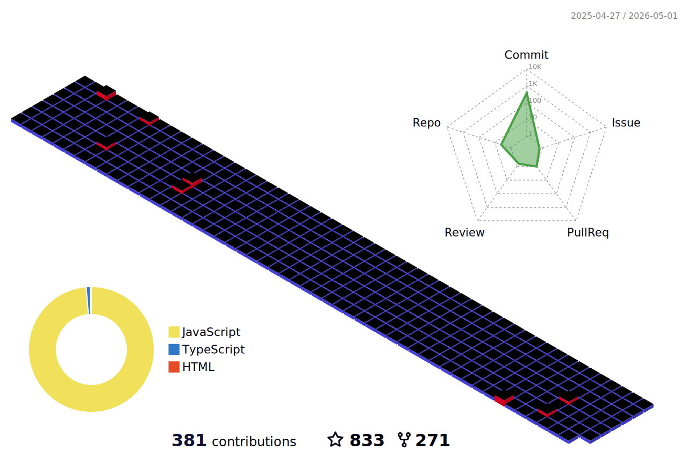

  
  
‍

<!-- Snake Code Contribution Map -->
<picture>
  <source media="(prefers-color-scheme: dark)" srcset="https://raw.githubusercontent.com/csxiaoyaojianxian/csxiaoyaojianxian/output/github-contribution-grid-snake-dark.svg">
  <source media="(prefers-color-scheme: light)" srcset="https://raw.githubusercontent.com/csxiaoyaojianxian/csxiaoyaojianxian/output/github-contribution-grid-snake.svg">
  
</picture>

<!-- github data -->

  
  
  

<!--  
 
 -->

更多数据

  
  <!--  -->

  

  <a align="center"  href="https://star-history.com/#csxiaoyaojianxian/JavaScriptStudy&Date">
  <picture align="center" >
    <source media="(prefers-color-scheme: dark)" srcset="https://api.star-history.com/svg?repos=csxiaoyaojianxian/JavaScriptStudy&type=Date&theme=dark" />
    <source media="(prefers-color-scheme: light)" srcset="https://api.star-history.com/svg?repos=csxiaoyaojianxian/JavaScriptStudy&type=Date" />
    
  </picture>
  </a>

<!-- just for beauty -->

&nbsp;

## 博客最新文章RSS
<!-- RSS -->
<!-- BLOG-POST-LIST:START -->
- [【前端er入门Shader系列】05—在cocos中使用shader实现简单特效](https://blog.csxiaoyao.com/archives/604)
- [【前端er入门Shader系列】04—MVP矩阵与纹理映射](https://blog.csxiaoyao.com/archives/602)
- [【前端er入门Shader系列】03—Shader形状绘制](https://blog.csxiaoyao.com/archives/600)
- [【前端er入门Shader系列】02—GLSL语言基础](https://blog.csxiaoyao.com/archives/598)
- [【前端er入门Shader系列】01—从渲染管线了解Shader](https://blog.csxiaoyao.com/archives/596)
<!-- BLOG-POST-LIST:END -->

 
  访问统计 
  

<!-- sign -->

